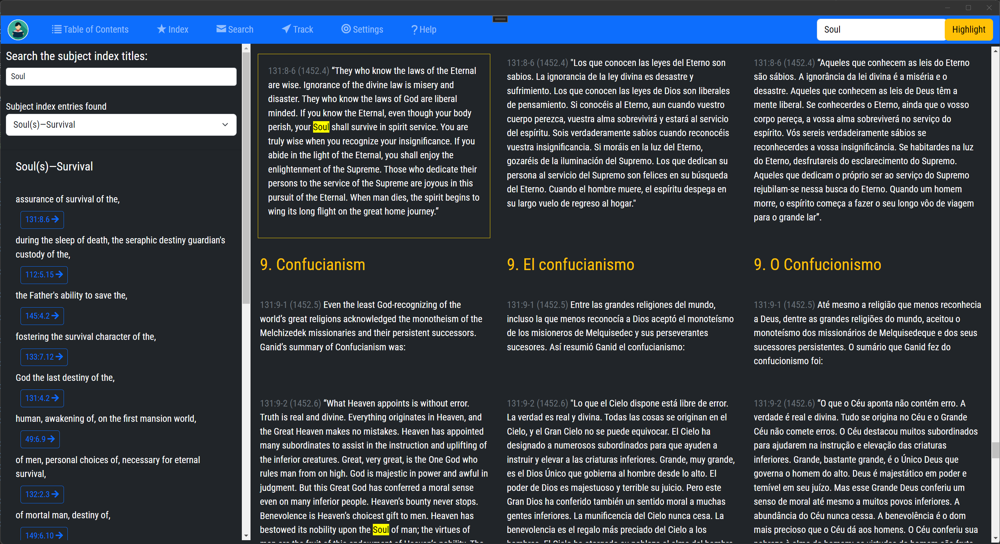
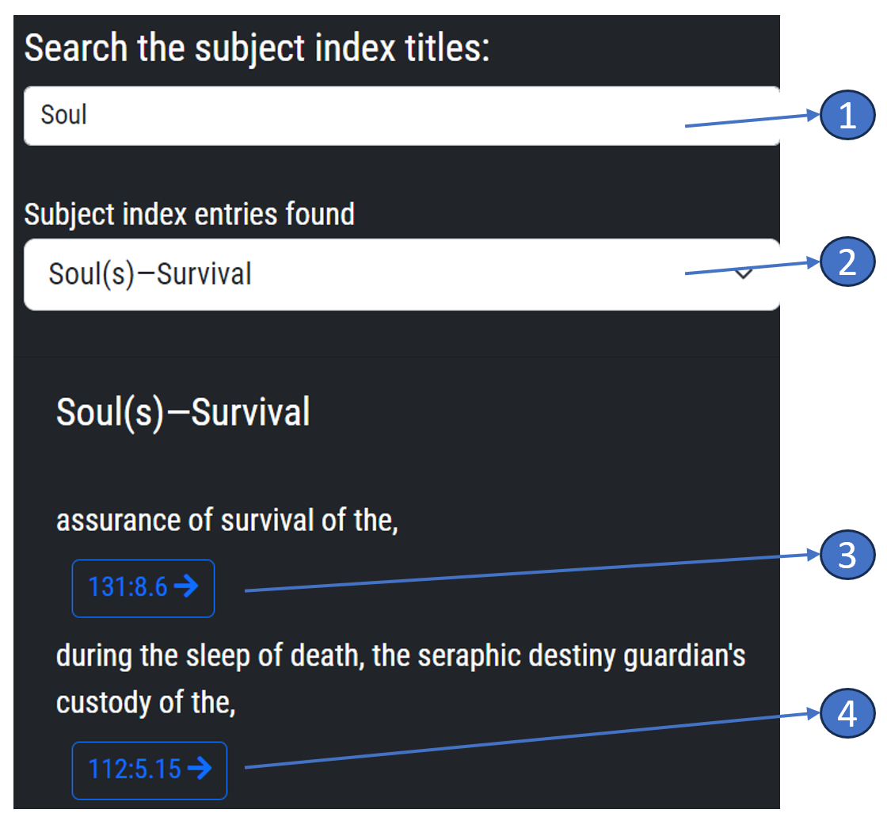

## Subject Index Feature - Help Guide

### Introduction

The Subject Index is a crucial feature of our application designed to provide you with quick access to specific topics across "The Urantia Book". Each entry in the index is composed of a key expression and the subject, with a clickable link below the subject. This guide will assist you in understanding how to effectively use this feature.

### How to Use the Subject Index

1.  **Navigate to the Subject Index**: This can typically be found in the [menu bar](menubar.md) of the application, labelled as 'Index'.
    
2.  **Browse the Index**: The Subject Index is organized alphabetically, with each key expression and linked subject listed in alphabetical order. Scroll through the list or use the alphabetical shortcuts to quickly jump to a section of the index.
    
3.  **Key Expression**: This is a succinct phrase or term that encapsulates the essence of the linked subject. It provides a snapshot of the topic you'll explore when you click the associated link.
    
4.  **Linked Subject**: Next to the key expression, you will find the linked subject. This denotes the actual content from "The Uantia Book" that the key expression refers to.
    
5.  **Using the Link**: To the left of each subject is a clickable link. Clicking this link will take you directly to the relevant section of "The Uantia Book". The link may be a specific page number, a section name, or a unique identifier for digital versions.
    

### Tips for Using the Subject Index

1.  **Start Broad**: If you're not exactly sure what you're looking for, start with a broad key expression that encompasses a larger theme or topic. This can help narrow down your search.
    
2.  **Use the Search Function**: If the Subject Index is extensive, you can use the built-in search function to find specific key expressions or subjects.
    
3.  **Follow the Links**: Don't be afraid to follow the links to the subjects. These will take you directly to the corresponding content in "The Uantia Book".
    

### Troubleshooting

If you're having trouble with the Subject Index, here are some tips:

1.  **Can't Find a Topic**: Not all topics may be listed in the Subject Index. If you can't find a specific topic, try using different keywords or use the main search engine of the application.
    
2.  **Link Doesn't Work**: If a link doesn't lead to the correct section, it might be a technical issue. If the problem persists, please report the issue to our support team.
    

Remember, the Subject Index is a tool designed to make your reading of "The Uantia Book" more efficient and enjoyable. If you need further assistance, feel free to contact our support team.

> Written with [StackEdit](https://stackedit.io/).
<!--stackedit_data:
eyJoaXN0b3J5IjpbLTQzNDA0NTM1OCwxNTY0NTI3MzQwLDUxNT
UwNzY5NSwtMTk4NTMxOTc0LDEwNDUzNjc2MzJdfQ==
-->