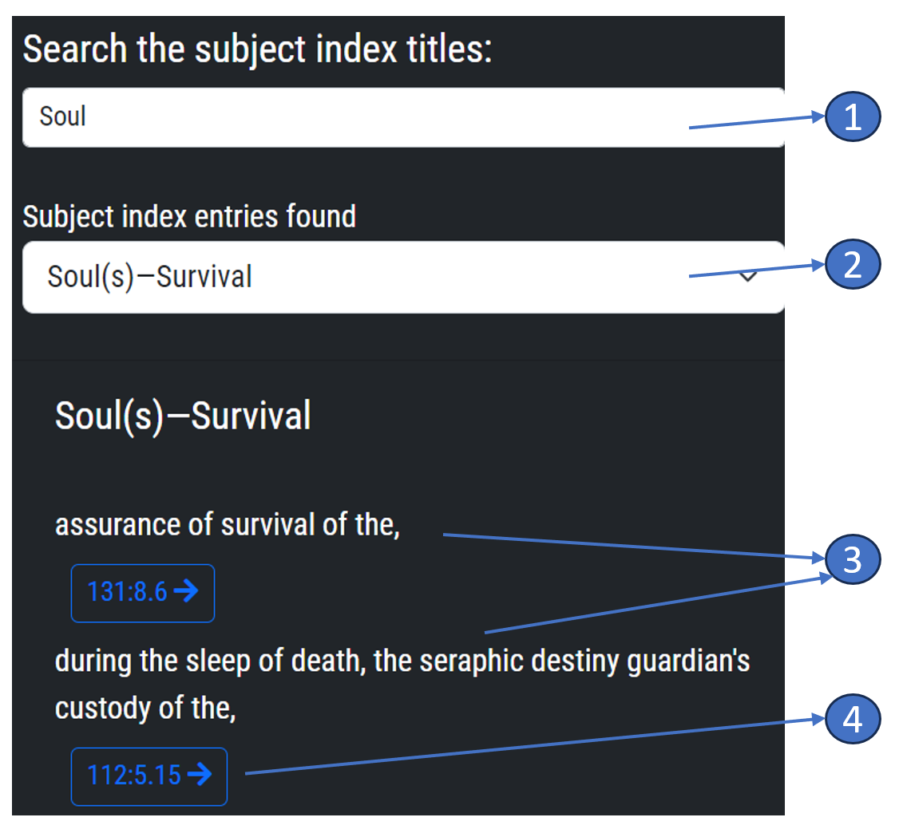

## Subject Index Feature - Help Guide

### Introduction

The Subject Index is a crucial feature of our application designed to provide you with quick access to specific topics across "The Urantia Book". Each entry in the index is composed of a key expression and the subject, with a clickable link below the subject. This guide will assist you in understanding how to effectively use this feature.

### How to Use the Subject Index

**Navigate to the Subject Index**: This can typically be found in the [menu bar](menubar.md) of the application, labelled as 'Index'.

### Using the Subject Index

1.  **Search Term**: Enter a search term of at least three letters into the search field. As you type, the app will automatically start generating concise titles that match your search term, populating the following combobox field with these results.
    
2.  **Title Selection**: The combobox will display a list of concise titles found based on the letters you've entered. These titles represent groups of subjects within the book. Select a title from the dropdown list, and the page below will be automatically populated with the relevant subject entries.  
    
3.  **Subject Entries Page**: On this page, you'll see a list of short subject descriptions, each followed by a link. These links lead to the corresponding passages in "The Urantia Book". This expanded view contains all entries related to the chosen subject. These entries indicate where in "The Urantia Book" the subject occurs, giving you direct access to every mention of the subject across the entire book.
    
4.  **Link to Text**: Click on the links provided if the subject matches what you're interested in what will take you directly to the relevant section of "The Uantia Book" that will be displayed in the column or columns to the right. Each clicked link not only opens the corresponding text but also gets recorded in the "Tracking" page for future reference.  The link may be a specific paper number, a section name, or paragraph.
    

### Tips for Using the Subject Index

1.  **Start Broad**: If you're not exactly sure what you're looking for, start with a broad key expression that encompasses a larger theme or topic. This can help narrow down your search.
    
2.  **Use the Search Function**: The Subject Index is extensive, hard to be used in a paper book, then you can use the built-in search function to find specific subjects.
    
3.  **Follow the Links**: Don't be afraid to follow the links to the subjects. These will take you directly to the corresponding content in "The Urantia Book".
    

### Troubleshooting

If you're having trouble with the Subject Index, here are some tips:

1.  **Can't Find a Topic**: Not all topics may be listed in the Subject Index. If you can't find a specific topic, try using different keywords or use the main search engine of the application.
    
2.  **Link Doesn't Work**: If a link doesn't lead to the correct section, it might be a technical issue. If the problem persists, please report the issue to our support team.
    
This feature is designed to make your study of "The Urantia Book" more focused and efficient by bringing all instances of a particular subject together, saving you the time and effort of manually searching through the book.

If you need further assistance using the Subject Index or any other feature of the Amadon app, please don't hesitate to contact our support page.

> Written with [StackEdit](https://stackedit.io/).
<!--stackedit_data:
eyJoaXN0b3J5IjpbMTE1MjgzMzg1NCwtMTkxOTMyNTcxLDE1Nj
Q1MjczNDAsNTE1NTA3Njk1LC0xOTg1MzE5NzQsMTA0NTM2NzYz
Ml19
-->