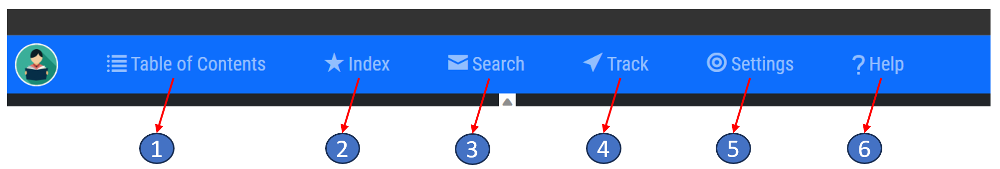

## Amadon App Menu Bar - Help Guide

### Introduction

The menu bar is the primary way to navigate through the Amadon app. This guide will explain each menu option and its function.

### Menu Options

1.  **Table of Contents**: The Table of Contents is an organized listing of all the papers and sections within "The Urantia Book". It provides an overview of the book's structure and allows you to directly access any section or paper by simply clicking on its title.
    
2.  **Index**: The Index is an alphabetical listing of the key expressions and subjects throughout "The Urantia Book". Each subject is linked to its relevant section within the book. Use this feature to quickly find and navigate to specific topics.
    
3.  **Search**: The Search feature allows you to find specific words, phrases, or topics throughout "The Urantia Book". Powered by Lucene.net, this search engine can handle complex queries and return precise results. You can find more detailed information on how to use this feature in our "Search Engine Help Guide".
    
4.  **Track**: The Track feature is a tool for keeping track of your progress through "The Urantia Book". As you read, use this feature to mark read paragraphs. This allows you to quickly identify what you have already read and where you left off.
    
5.  **Settings**: In the Settings menu, you can customize the app according to your preferences. This includes adjusting the text size, theme, notification settings, and more. Any changes made in this menu will be applied across the app.
    
6.  **Help**: The Help option provides assistance on how to use the app and its features. It includes various help guides and troubleshooting tips. If you are having difficulty with any aspect of the app, this should be your first port of call.
    

### Navigating the Menu Bar

To use the menu bar, simply click on the desired option. The corresponding feature will open in the main window of the app. To return to the previous view, click the "Back" button, usually located in the top-left corner of the app.

### Tips for Using the Menu Bar

1.  **Explore Each Option**: Don't be afraid to explore each menu option to familiarize yourself with its functionality. Understanding how to navigate the app will enhance your overall reading experience.
    
2.  **Customize Your Settings**: Make sure to check out the Settings menu to tailor the app to your reading preferences.
    
3.  **Use the Help Option**: If you're unsure about anything, remember the Help option is there to assist you.
    

Remember, the goal of the Amadon app is to make your reading experience of "The Urantia Book" as enjoyable and efficient as possible. If you have any questions or need further assistance, don't hesitate to contact our support team.

> Written with [StackEdit](https://stackedit.io/).
<!--stackedit_data:
eyJoaXN0b3J5IjpbMTA2MzI0MDkxMSwxNDg2NzgzODY4XX0=
-->