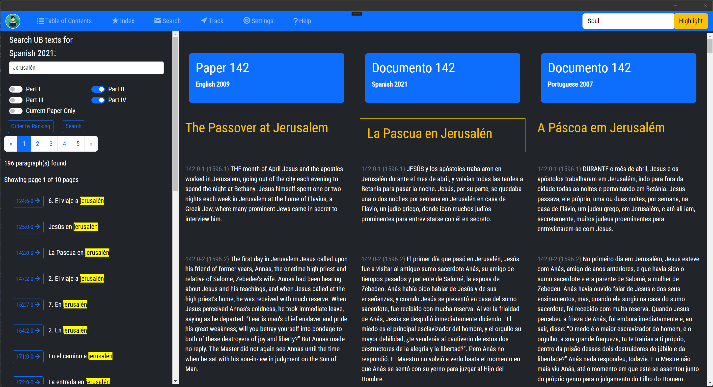

## Amadon Search Engine - Help Guide

### Introduction
Amadon search engine is based on  Lucene.net, a powerful search library, which can provide advanced search functionality to any application. This help guide will walk you through the basics of using the Lucene.net based search engine in our application.

### Getting Started

1.  **Input Your Search Query**: Type your search term in the search box and press enter. You can search for a single word, a phrase, or use advanced queries.

### Search Operators

Our search engine supports several search operators:

1.  **AND**: This operator matches documents where both terms exist anywhere in the text. To search for documents that contain "term1" and "term2", use: `term1 AND term2`
    
2.  **OR**: This operator matches documents where either term exists anywhere in the text. To search for documents that contain "term1" or "term2", use: `term1 OR term2`
    
3.  **NOT**: This operator excludes documents that contain the term after NOT. To search for documents that contain "term1" but not "term2", use: `term1 NOT term2`
    
4.  **"+": (Must)**: This operator makes a term mandatory, or "must appear" in the result. To search for documents that must contain "term1", use: `+term1`
    
5.  **"-": (Must Not)**: This operator requires that the term must not appear in the document. To search for documents that must not contain "term1", use: `-term1`
    
6.  **"*": (Wildcard)**: The wildcard operator can be used to search for partial words. For instance, to find documents containing words that start with "term", use: `term*`
    
7.  **"~": (Fuzzy Search)**: This operator can be used when you are not sure of the correct spelling. To perform a fuzzy search, use: `term~`
    
8.  **"": (Phrase)**: This operator is used to search for exact phrases. For instance, to find documents containing the exact phrase "my phrase", use: `"my phrase"`
    

### Search Tips

1.  Lucene.net search is case insensitive. For example, searching for "term" will also return "Term" or "TERM".
    
2.  Special characters need to be escaped with "". For example, to search for "(1+1)=2", use: `\(1\+1\)=2`
    
3.  Avoid using a single wildcard (*) as a search term, as it may return too many results and slow down the search.
    

### Troubleshooting

If you're having issues with the search functionality, try these steps:

1.  Check your search term for typos or spelling mistakes.
    
2.  If you're using search operators, ensure that they're formatted correctly.
    
3.  If the search is returning too many irrelevant results, try adding more specific terms or using the AND or "+" operator to narrow down the results.
    
4.  If the search is returning too few or no results, try using broader terms or the OR operator to widen the search.
    

Remember, the aim of the search is to help you find exactly what you're looking for in the most efficient way. Happy searching!

https://lucene.apache.org/core/2_9_4/queryparsersyntax.html

> Written with [StackEdit](https://stackedit.io/).
<!--stackedit_data:
eyJoaXN0b3J5IjpbNzY3MjY5NTg3LDEzNzAxMDI4NzMsMTU1NT
Q1NDY1MF19
-->