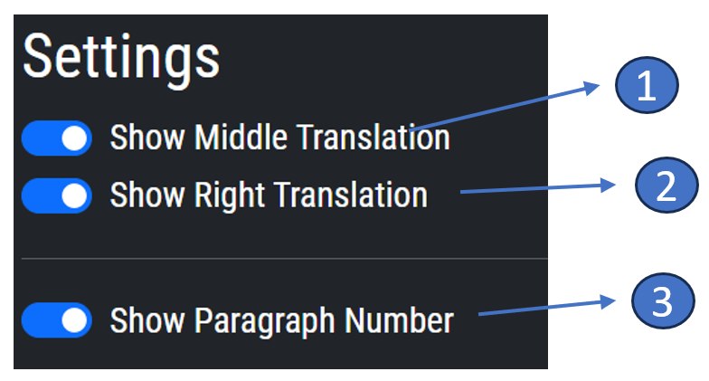
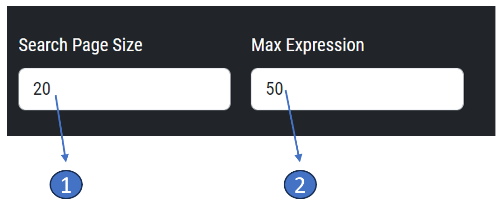
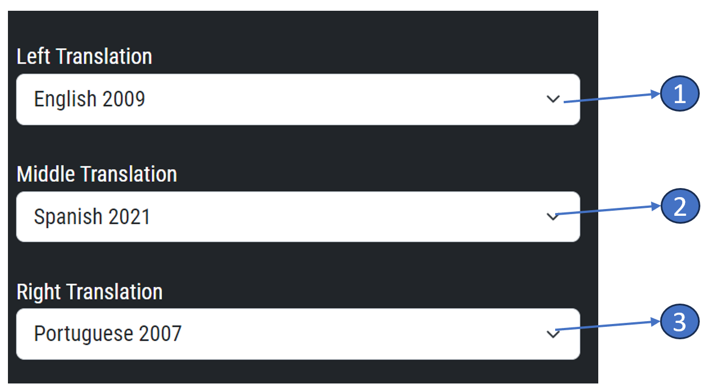
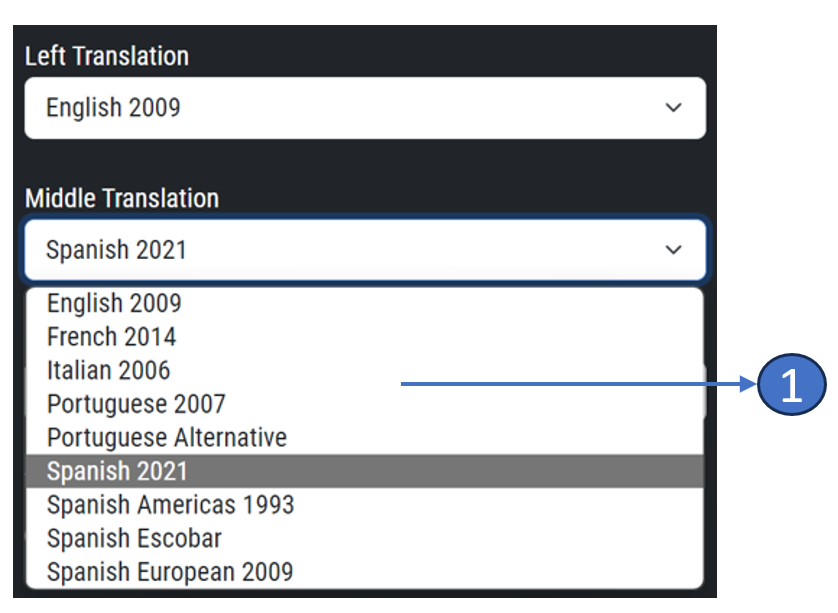
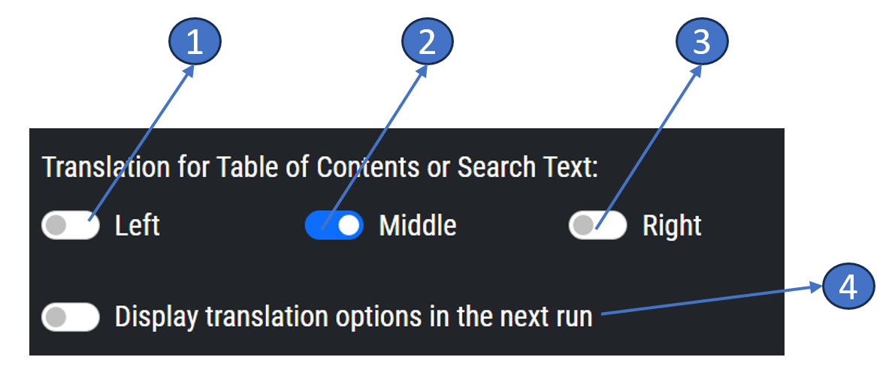

## Amadon App Settings Page - Help Guide

### Introduction

The Settings page is where you can customize your reading experience in the Amadon app. Here's what you can do:

### Reading Options

1.  **Show/Hide Middle Translation**: This option allows you to toggle the visibility of the middle translation of "The Urantia Book". If you wish to view two translations at once, you can choose to show the middle translation. Otherwise, you can hide it for a less cluttered view.
    
2.  **Show/Hide Right Translation**: Similar to the middle translation, this option lets you toggle the visibility of the right translation. Show or hide this based on your reading preferences.
    
3.  **Show/Hide Paragraph Number**: If you prefer a minimalist view or if you're using a reading tool to listen to the translations, you can choose to hide the paragraph numbers. To display the numbers for reference, select 'Show'.

### Updated Settings Options

1.  **Search Page Size**: This setting allows you to adjust the maximum number of paragraphs a search page will contain. By controlling the page size, you can manage the volume of search results that are displayed at once, thereby making the results easier to sift through. To modify the Search Page Size, navigate to this option in the Settings, enter your preferred number of paragraphs, and save the changes.
    
2.  **Max Expression**: The Max Expression setting is related to the maximum number of expressions that can be stored for the Search Engine or the Subjects Index search for titles. This means you can control how many past search expressions or titles the system will remember for future use. To modify the Max Expression, navigate to this option in the Settings, enter your preferred number of expressions, and save the changes.    

### Translation Choices
| |  |

1.  **Left Translation Choice**: The left translation is mandatory in our layout. However, you can select which translation to display on the left from the available options.
    
2.  **Middle Translation Choices**: You can choose which translation to display in the middle position. If you've chosen to show this column, select your preferred version from the available options.

3. **Right Translation Choices**: You can also choose which translation to display in the right position. If you've chosen to show this translation, select your preferred version from the available options.
    
In the second you can see the translations options open and the selection for 'Spanish 2021'.

### Search,  Contents and App Load Options

**Table Of Contents and Search Engine Translation**: This setting allows you to choose the translation used in the Table of Contents and the Search Engine. This ensures that your search results and table of contents match the translation you are most comfortable with. Your choices are
1.  Use the mandatory always shown left translation.
2.  Use the middle translation when shown.
3.  Use the right translation when shown.
4.  **Choose Translations on App Load**: Upon the first launch of the app, you can choose a subset of "The Urantia Book" translations to use. Once this is set, it's usually fixed. However, if you want to change your choices, you can toggle this option on. Next time you load the app, you'll be prompted to choose your translations again.

### How to Modify Settings

To change a setting, navigate to the 'Settings' option in the menu bar. Find the feature you wish to modify, then select or deselect the checkbox for toggle features or choose from a dropdown list for selection features. Your changes will be automatically saved and applied throughout the app.

Remember, the Settings page is designed to make your reading experience more personalized and enjoyable. Feel free to experiment with different settings to see what works best for you. If you need further help, don't hesitate to contact our  [support team](https://github.com/Rogreis/UbStudyHelpMAUI/issues) or send an email to rogreis at gmail dot com.

> Written with [StackEdit](https://stackedit.io/).
<!--stackedit_data:
eyJoaXN0b3J5IjpbLTYzMDU5NzQ5OSwtMjA5NzMwODAxNiwyND
QzMzg4NTksMTAyNDAzNjkyOSwxNDU5ODA2NDU0LDEwOTQyMzY5
OTEsLTIwMDA1ODExNjcsLTE4MTcyOTQ4MzddfQ==
-->