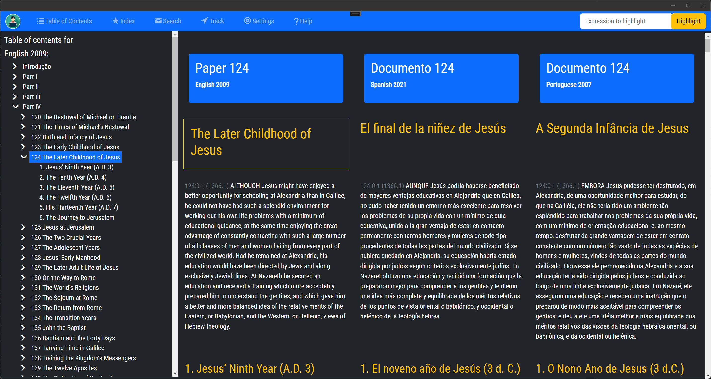

## Amadon App Table of Contents - Help Guide

### Introduction

The Table of Contents in the Amadon app is designed to provide you with an organized, hierarchical view of "The Urantia Book". Presented in a treeview format, it makes navigating through the various parts, papers, and sections of the book simple and efficient.

### Structure of the Table of Contents

The Table of Contents is divided into primary nodes representing the main divisions of "The Urantia Book":

1.  **Introduction**
2.  **Part I**
3.  **Part II**
4.  **Part III**
5.  **Part IV**

Each of these nodes expands to reveal secondary nodes, which represent the individual papers contained within each part. These paper nodes further branch out into tertiary nodes, which represent the sections within each paper.

For instance, clicking on "Part I" reveals all the papers within that part. Clicking on a specific paper under "Part I" then reveals all the sections within that paper. The "Introduction" node is unique as it contains only a single paper, also titled "Introduction".

### Using the Table of Contents

To navigate the Table of Contents:

1.  Click on a primary node to reveal the papers (secondary nodes) within the selected part.
2.  To view the sections (tertiary nodes) of a paper, click on the corresponding secondary node.
3.  To open a particular section, paper, or part in the main view, simply click on its corresponding node in the Table of Contents.

By default, the nodes in the Table of Contents are collapsed for a clean and organized view. They expand as you click on them, allowing you to navigate directly to the part, paper, or section of your choice.

Remember, the goal of the Table of Contents is to facilitate easy navigation through "The Urantia Book". Explore the different parts, papers, and sections at your own pace. If you encounter any issues or need further assistance, please reach out to our support team.

> Written with [StackEdit](https://stackedit.io/).
<!--stackedit_data:
eyJoaXN0b3J5IjpbLTEzNjgyNjUzNTIsNzMwOTk4MTE2XX0=
-->